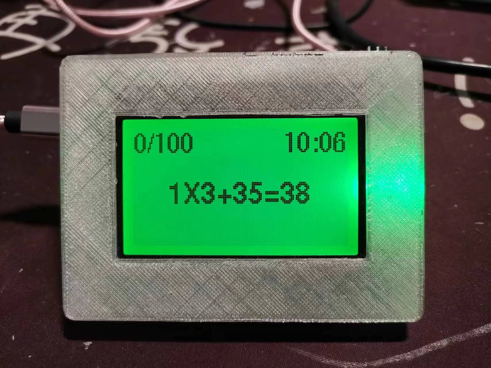
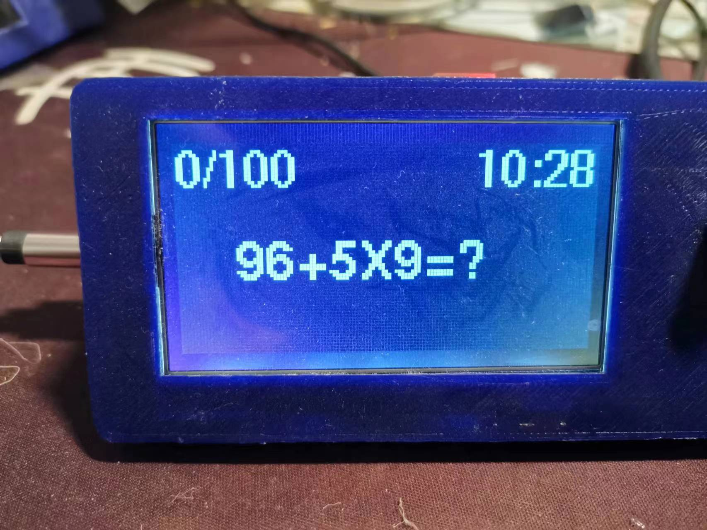

# ESP12-MathToy-SPI-New12864

An ESP-12 (ESP8266) version of the math-practice toy: generates a mix of
addition/subtraction/multiplication questions on a 128x64 SPI LCD, syncs a
WiFi-based clock via NTP, and auto-dims the backlight based on ambient light.
A single push-button reveals the answer and advances to the next question.

 

## Setup

1. Install dependencies: `U8g2`, `WiFiManager`.
2. **Before flashing, replace the placeholder values** at the top of the
   .ino: `WIFI_SSID`/`WIFI_PWD` with your own network(s) - or better, enable
   `USE_WIFI_MANAGER` instead of hardcoding credentials at all, which puts up
   a "ESP8266-Setup" WiFi config portal on first boot.

## Notes

- `garfield`/`activeSymbole`/`inactiveSymbole` in `MathImages.h` are bitmap
  data for the boot splash screen and unused status icons.
- Only addition/subtraction/multiplication are generated (no division) -
  see [Nano-MathToyMix100-12864](https://github.com/bobhuang1/Nano-MathToyMix100-12864)
  for a version that also includes division.
